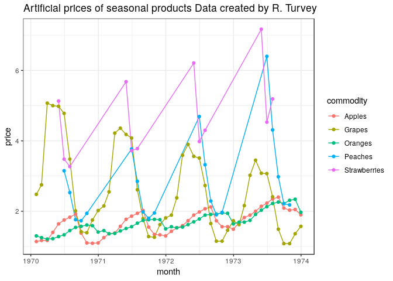
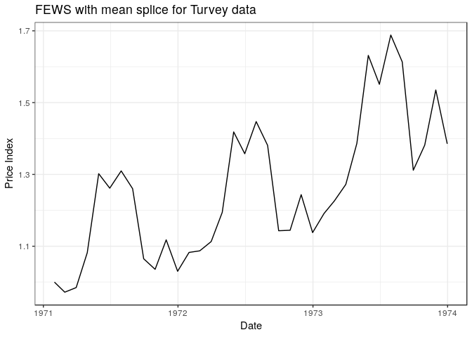

<!-- README.md is generated from README.Rmd. Please edit that file -->
FEWS
====

The FEWS method was introduced by Frances Krsinich in [title](www.google.com). This FEWS package aims to provide a flexible implementation of that method, with some additional splicing options available for users. As well as producing an index, the package provides users with some diagnostic results on the FEWS calculation which may be of use in data exploration, or in monitoring of production systems. In addition the package provides some utilities commonly used by Pricing teams from Statistical Agencies such as converting between indexes and movements.

Installation
============

FEWS is still in development, with the intention that it will exist on CRAN. For now it can be installed from GitHub using the following code

``` r

devtools::install_github("Donal-lynch/FEWS_package")
```

Usage
=====

The primary function for the FEWS package is the `FEWS()` function. Running `?FEWS()` should provide all of the required information on how use the function. An example of using the function is shown below.

Example
-------

As part of the package, a couple of datasets are provided, including the Turvery dataset as found in the [Consumer Price Index Manual](https://www.ilo.org/wcmsp5/groups/public/---dgreports/---stat/documents/presentation/wcms_331153.pdf).

``` r
ggplot(turvey, aes(x = month, y = price)) + 
  geom_line(aes(color = commodity)) + 
  geom_point(aes(color = commodity))+
  ggtitle("Artificial prices of seasonal products Data created by R. Turvey")
```



The FEWS is calculated below with a mean splice and a window length of 13 months.

``` r
turvey_FEWS <- FEWS(times = turvey$month,
                    logprice = log(turvey$price),
                    id = turvey$commodity,
                    window_length = 13,
                    weight = turvey$price * turvey$quantity,
                    splice_pos = "mean",
                    num_cores = NULL)
```

The resulting index is displayed below

``` r

ggplot(turvey_FEWS$fews, aes(x = price_date, y = fe_indexes)) + 
  geom_line() + 
  ggtitle("FEWS with mean splice for Turvey data")+
  xlab("Price Index") + 
  ylab("Date")
```


